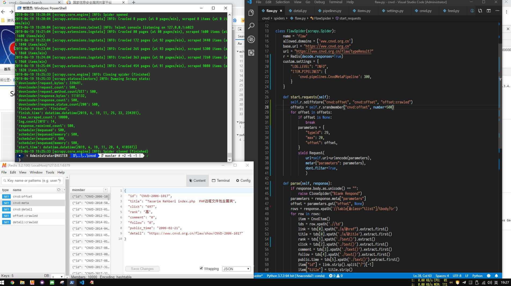
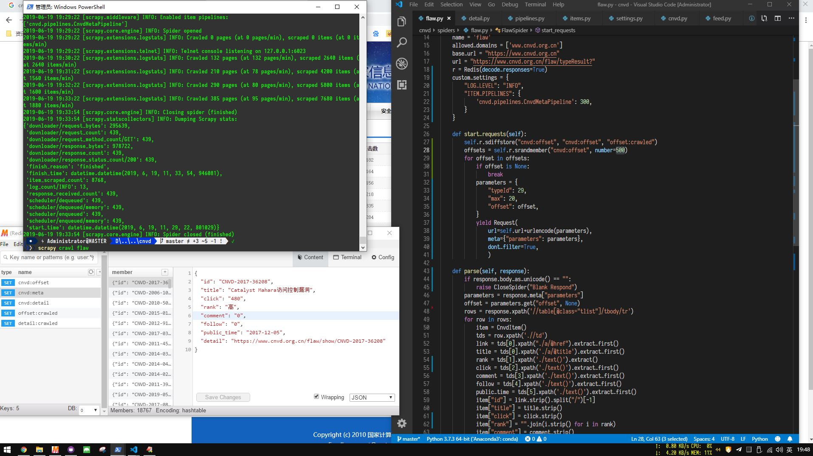
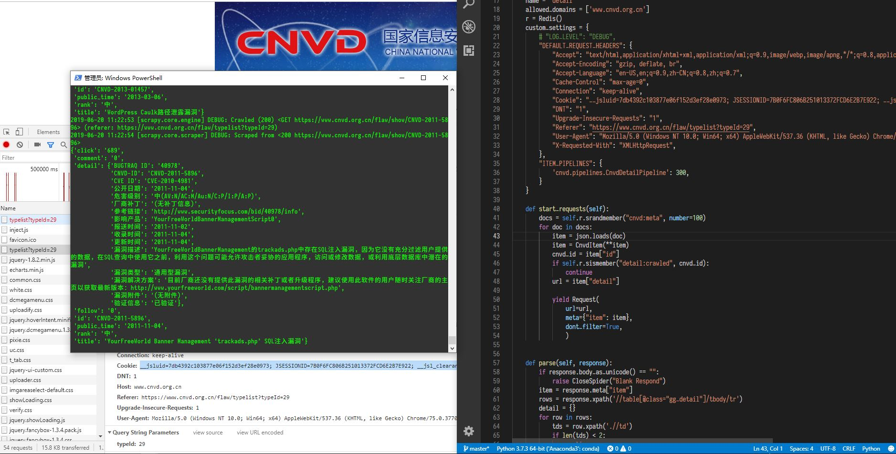

# 说明

该网站采用加速乐动态cookies, 访问频率过快会封禁ip一定时间(5-10分钟),  
因为数据量不大, 不需要使用代理, 使用最快不会被封禁的速度即可.  

# 流程

分成两部分:
1, 爬取列表页面信息, 生成部分item信息, 保存已经抓取的offset
2, 利用抓取的部分item信息中的详细页面url, 爬取详细信息

最后, 爬取列表页利用cookies校验不严格可以不受限制爬取,  
详细页面, 使用同样的cookies但保持DOWNLOAD_DELAY大于等于5就不会触发封禁  

  

  

